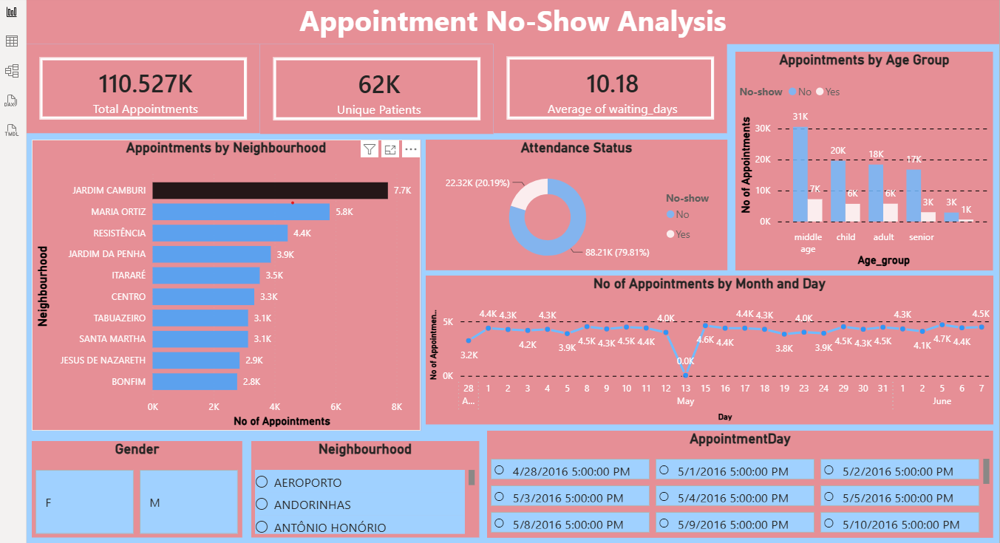

<div align="center">

# 🏥 Appointment No-Show Analysis

### Exploratory Data Analysis with Python & Interactive Power BI Dashboard


</div>

---

## 📌 About the Project

**Appointment No-Show Analysis** is an end-to-end data analysis project built around medical appointment attendance data.

The project starts with **Exploratory Data Analysis (EDA) in Python**, where the dataset is inspected, cleaned, transformed, and analyzed to understand patterns related to appointment no-shows.

The cleaned data is then used to create an **interactive Power BI dashboard** that presents the main findings through KPIs, charts, and filters.

The main focus of the project is to understand **which patient and appointment characteristics are associated with missed appointments** rather than trying to predict individual no-shows.

---

## 🔄 Project Workflow

```text
Raw Appointment Data
        │
        ▼
   Data Inspection
        │
        ▼
 Data Cleaning & Preparation
        │
        ▼
 Feature Creation
        │
        ├── Waiting Days
        ├── Age Groups
        └── Weekdays
        │
        ▼
 Exploratory Data Analysis
        │
        ▼
     Key Findings
        │
        ▼
 Cleaned CSV Dataset
        │
        ▼
   Power BI Dashboard
```

---

# 🔍 Exploratory Data Analysis

The EDA was performed using **Python, Pandas, NumPy, Matplotlib, and Seaborn**.

### 🧹 Data Cleaning & Preparation

The notebook includes:

- Dataset inspection using `info()` and `describe()`
- Missing-value analysis
- Inspection of rows containing missing values
- Removal of rows containing missing values
- Duplicate-record checking
- Conversion of `ScheduledDay` and `AppointmentDay` into datetime format
- Creation of a **Waiting Days** feature
- Filtering records based on valid waiting days
- Creation of **Age Group** categories
- Creation of a **Weekday** feature
- Exporting the cleaned dataset as `appointment_noshow_cleaned.csv`

### 📊 Analysis Performed

The EDA explores appointment no-shows across:

- Overall No-Show status
- Gender
- Age Groups
- SMS reminders
- Age distribution
- Handicap status
- Diabetes
- Alcoholism
- Hypertension
- Scholarship
- Neighbourhood
- Weekday
- Waiting Days

### 📈 Visualizations

The notebook uses visualizations such as:

- Count plots
- Histograms
- Grouped count plots
- No-show distribution charts
- Neighbourhood comparisons
- Weekday comparisons
- Age distribution comparisons

---

# 📊 Power BI Dashboard

After the Python-based EDA and data preparation, the project presents the analysis in an interactive **Power BI dashboard**.

The dashboard gives a high-level view of appointment volume, patient coverage, waiting time, attendance status, and appointment patterns.

### 📌 Dashboard Includes

- **110.527K Total Appointments**
- **62K Unique Patients**
- **10.18 Average Waiting Days**
- Appointments by **Neighbourhood**
- **Attendance Status / No-Show** distribution
- Appointments by **Age Group**
- Number of Appointments by **Month and Day**
- **Gender** filter
- **Neighbourhood** filter
- **AppointmentDay** filter

### 🖥️ Dashboard Preview

<p align="center">
  
</p>

---

# 💡 Key Findings

The analysis identified several patterns in appointment attendance:

### 📍 Overall Attendance

**20.19%** of scheduled appointments resulted in a **no-show**, while **79.81%** were attended.

### 👥 Age Groups

Among the analyzed age groups, **adults had the highest no-show rate at 23.83%**, while **seniors had the lowest at 15.21%**.

### 📱 SMS Reminders

Patients who received an SMS reminder had a **27.57% no-show rate**, compared with **16.70%** for patients who did not receive an SMS reminder.

This is an observed association in the dataset and does **not** establish that SMS reminders caused a higher no-show rate.

### 🚻 Gender

The analysis found **almost no meaningful difference** in no-show behavior between genders.

### ⚠️ Important Limitation

The dataset does not contain the actual reasons why patients missed their appointments. Therefore, the analysis identifies **patterns and associations**, but it cannot determine a definitive cause of no-shows.

---

# 🛠️ Tools & Technologies

| Tool | Purpose |
|---|---|
| 🐍 Python | Data analysis and preprocessing |
| 🐼 Pandas | Data manipulation and analysis |
| 🔢 NumPy | Numerical operations |
| 📊 Matplotlib | Data visualization |
| 🌊 Seaborn | Statistical visualization |
| 📈 Power BI | Interactive dashboard |
| 📓 Jupyter Notebook | EDA development |

---

# 📂 Project Files

```text
Appointment-No-Show-Analysis/
│
├── Appointment_NoShow_EDA.ipynb
├── appointment_noshow.csv
├── appointment_noshow_cleaned.csv
├── *.pbix
├── dashboard.png
└── README.md
```

> The Power BI `.pbix` file is kept in the repository root so the dashboard project is available alongside the EDA and cleaned dataset.

---

# 📚 Topics Covered

### 🔍 Data Analysis
- Exploratory Data Analysis (EDA)
- Data Cleaning & Preprocessing
- Missing Value Analysis
- Duplicate Checking
- Date & Time Analysis

### 📊 Feature Analysis
- Waiting Days
- Age Groups
- Gender
- SMS Reminders
- Health-related Factors
- Neighbourhood
- Weekdays
- Appointment Days

### 📈 Visualization & Insights
- No-Show & Attendance Analysis
- Age Distribution Analysis
- Neighbourhood Analysis
- Weekday Analysis
- Pattern & Trend Analysis
- Data Visualization

### 📊 Dashboard
- Interactive Power BI Dashboard
- Appointment KPIs
- Attendance Status
- Age Group Analysis
- Neighbourhood Analysis
- Monthly & Daily Appointment Trends
- Interactive Filters

---

# 🎯 Project Goal

The goal of this project is to turn raw medical appointment data into clear, understandable insights by combining **Python-based EDA** with **Power BI reporting**.

It demonstrates the complete flow from **data inspection and cleaning → feature preparation → exploratory analysis → insight generation → interactive dashboard**.

---

<div align="center">

### 📊 Analyze the Data • Find the Patterns • Understand the Insights

**Made with ❤️ by Umer Farooq**

</div>
